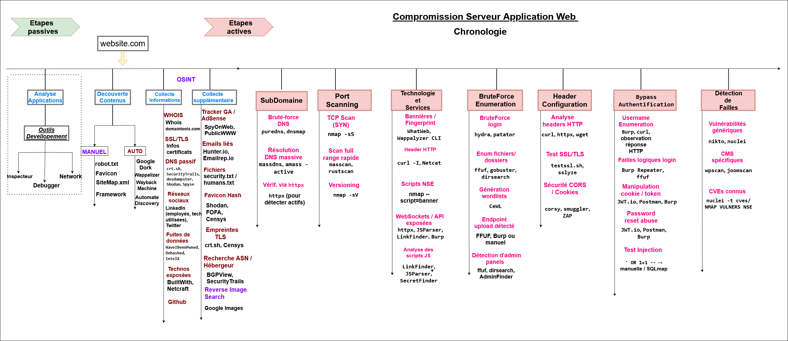

# 🧭 Phase Active : Subdomain Enumeration

Ce guide fournit toutes les commandes **copiables** pour découvrir les sous-domaines d'une cible. Il comprend :
- la création de l'environnement de travail,
- l'installation des outils nécessaires,
- les commandes étape par étape.

---

## 📁 Initialisation des variables et structure des dossiers

```bash
export DOMAIN="example.com"
export OUTDIR="out/$DOMAIN/01-subdomains"
mkdir -p "$OUTDIR"/{{raw,clean,live,screens,tmp}}
```

---

## 🛠️ Installation des outils nécessaires

```bash
# Go tools
go install -v github.com/projectdiscovery/subfinder/v2/cmd/subfinder@latest
go install github.com/tomnomnom/assetfinder@latest
go install -v github.com/owasp-amass/amass/v4/...@master
go install github.com/d3mondev/puredns/v2@latest
go install -v github.com/projectdiscovery/dnsx/cmd/dnsx@latest
go install -v github.com/projectdiscovery/httpx/cmd/httpx@latest
go install github.com/sensepost/gowitness@latest
go install -v github.com/projectdiscovery/mapcidr/cmd/mapcidr@latest

# MassDNS
git clone https://github.com/blechschmidt/massdns.git
cd massdns && make && cd ..

# Python tool
pip install dnsgen

# jq (pour parser le JSON)
sudo apt install jq -y
```
# 🌐 Dnsdumpster — Reconnaissance Passive via Interface Web

`Dnsdumpster` est un outil en ligne permettant d'obtenir des informations DNS publiques (sous-domaines, serveurs, IPs, schéma réseau) sans envoyer de requêtes actives vers la cible.

---

## 🔗 Accès à l'outil

Site officiel : [https://dnsdumpster.com](https://dnsdumpster.com)

Aucune installation nécessaire.

---

## 🧭 Étapes d'utilisation

1. Accéder au site : [https://dnsdumpster.com](https://dnsdumpster.com)
2. Entrer le nom de domaine (exemple : `example.com`)
3. Résoudre le captcha (si présent)
4. Lancer l’analyse
5. Télécharger les résultats :
   - `dnsdumpster.csv` (tableau de résultats)
   - `dnsdumpster.svg` (schéma visuel du réseau)

---

## 💾 Organisation locale des résultats

```bash
export DOMAIN="example.com"
export OUTDIR="out/$DOMAIN/01-subdomains"
mkdir -p "$OUTDIR/raw/dnsdumpster"

# Copier les fichiers manuellement depuis le dossier Téléchargements
mv ~/Téléchargements/dnsdumpster.csv "$OUTDIR/raw/dnsdumpster/results.csv"
mv ~/Téléchargements/dnsdumpster.svg "$OUTDIR/raw/dnsdumpster/map.svg"
```

---

## 🧪 Optionnel : extraire les sous-domaines depuis le CSV

```bash
cut -d',' -f1 "$OUTDIR/raw/dnsdumpster/results.csv" | grep -v '^$' | sort -u > "$OUTDIR/clean/dnsdumpster_subdomains.txt"
```

## 🔁 Ajouter les sous-domaines à la liste globale

```bash
cat "$OUTDIR/clean/dnsdumpster_subdomains.txt" >> "$OUTDIR/clean/passive_uniq.txt"
sort -u "$OUTDIR/clean/passive_uniq.txt" -o "$OUTDIR/clean/passive_uniq.txt"
```

---

## ✅ Résumé

| Fichier généré | Description |
|----------------|-------------|
| `results.csv` | Résultats bruts exportés depuis l’interface |
| `map.svg` | Schéma du réseau DNS et IP |
| `dnsdumpster_subdomains.txt` | Sous-domaines extraits (via CSV) |
| `passive_uniq.txt` | Liste finale des sous-domaines passifs enrichie |

---
---

## 1️⃣ Subfinder

```bash
subfinder -d "$DOMAIN" -all -silent | tee "$OUTDIR/raw/subfinder.txt"
```

## 2️⃣ Assetfinder

```bash
assetfinder --subs-only "$DOMAIN" | tee "$OUTDIR/raw/assetfinder.txt"
```

## 3️⃣ Amass (mode passif)

```bash
amass enum -passive -d "$DOMAIN" -silent | tee "$OUTDIR/raw/amass_passive.txt"
```

## 4️⃣ Fusion des résultats passifs

```bash
cat "$OUTDIR"/raw/*.txt | sort -u > "$OUTDIR/clean/passive_uniq.txt"
```

---

## 5️⃣ Puredns (bruteforce + résolution)

```bash
puredns bruteforce /path/to/wordlists/subdomains.txt "$DOMAIN" \
  -r resolvers.txt --wildcard-tests 5 --threads 50 \
  --write "$OUTDIR/raw/puredns_bruteforce.txt"

puredns resolve "$OUTDIR/raw/puredns_bruteforce.txt" -r resolvers.txt \
  --write "$OUTDIR/clean/bruteforce_resolved.txt"
```

---

## 6️⃣ MassDNS (résolution massive)

```bash
awk -v d="$DOMAIN" '{print $0"."d}' /path/to/wordlists/subdomains.txt > "$OUTDIR/tmp/fqdn.txt"

massdns/bin/massdns -r resolvers.txt -t A -o S -w "$OUTDIR/raw/massdns.out" \
  -s 10000 -q "$OUTDIR/tmp/fqdn.txt"

grep -Eo "^[^ ]+" "$OUTDIR/raw/massdns.out" | sed 's/\.$//' | sort -u \
  > "$OUTDIR/clean/massdns_resolved.txt"
```

---

## 7️⃣ DNSGen + MassDNS (permutations)

```bash
dnsgen "$OUTDIR/clean/passive_uniq.txt" --wordlist /path/to/words.txt \
  | sed 's/[[:space:]]//g' | sort -u > "$OUTDIR/tmp/dnsgen.txt"

massdns/bin/massdns -r resolvers.txt -t A -o S -w "$OUTDIR/raw/dnsgen_massdns.out" \
  -s 10000 -q "$OUTDIR/tmp/dnsgen.txt"

grep -Eo "^[^ ]+" "$OUTDIR/raw/dnsgen_massdns.out" | sed 's/\.$//' | sort -u \
  > "$OUTDIR/clean/perms_resolved.txt"
```

---

## 8️⃣ DNSx (résolution + IPs)

```bash
cat "$OUTDIR"/clean/*resolved*.txt | sort -u > "$OUTDIR/clean/all_subdomains_resolved.txt"

dnsx -silent -a -aaaa -resp -l "$OUTDIR/clean/all_subdomains_resolved.txt" \
  -o "$OUTDIR/clean/subs_with_ips.txt"
```

---

## 9️⃣ HTTPx (cibles web actives)

```bash
httpx -l "$OUTDIR/clean/all_subdomains_resolved.txt" -silent \
  -ports 80,443,8080,8443,8000,5000,3000 \
  -status-code -title -tech-detect -follow-redirects -json -threads 50 \
  -o "$OUTDIR/live/httpx_live.json"

jq -r '.url' "$OUTDIR/live/httpx_live.json" | sort -u > "$OUTDIR/live/urls.txt"
```

---

## 🔟 GoWitness (screenshots automatiques)

```bash
gowitness file -f "$OUTDIR/live/urls.txt" -P "$OUTDIR/screens" --timeout 10
```

---

## 🔢 MapCIDR (résumé IP vers CIDR)

```bash
awk '{print $2}' "$OUTDIR/clean/subs_with_ips.txt" | sed 's/,/\n/g' | sort -u > "$OUTDIR/tmp/ips.txt"
mapcidr -aggregate -silent -l "$OUTDIR/tmp/ips.txt" -o "$OUTDIR/clean/cidrs.txt"
```

---

## 📦 Résumé des fichiers générés

| Fichier | Description |
|--------|-------------|
| `subfinder.txt`, `assetfinder.txt`, `amass_passive.txt` | Résultats passifs |
| `bruteforce_resolved.txt`, `massdns_resolved.txt` | Résolution DNS |
| `all_subdomains_resolved.txt` | Fusion complète |
| `subs_with_ips.txt` | IPs des sous-domaines |
| `urls.txt`, `httpx_live.json` | Cibles HTTP(s) |
| `screens/` | Captures d'écran |
| `cidrs.txt` | Réseaux IP agrégés |

---

# 🚪 Phase Active — Scan de Ports (Port Scanning)

Cette étape consiste à identifier les services actifs sur les hôtes précédemment découverts via leurs ports ouverts. On utilise ici des outils efficaces comme `nmap`, `rustscan`, `naabu`, etc.

---

## 📁 Initialisation

```bash
export DOMAIN="example.com"
export OUTDIR="out/$DOMAIN/02-portscan"
mkdir -p "$OUTDIR"/{raw,clean}
```

Tu dois déjà avoir un fichier contenant les IPs à scanner, par exemple :

```bash
cat out/$DOMAIN/01-subdomains/clean/subs_with_ips.txt | awk '{print $2}' | sed 's/,/\n/g' | sort -u > "$OUTDIR/targets.txt"
```

---

## 🛠️ Outils à installer

```bash
# Nmap (classique)
sudo apt install nmap -y

# Rustscan (rapide)
cargo install rustscan

# Naabu (scan TCP passif)
go install -v github.com/projectdiscovery/naabu/v2/cmd/naabu@latest

# Masscan (ultra rapide, bruit fort)
sudo apt install masscan -y
```

---

## ⚡ Rustscan — Scan rapide des ports TCP

```bash
rustscan -a "$OUTDIR/targets.txt" --ulimit 5000 -b 1500 -- -sS -Pn -n -T4 -oA "$OUTDIR/raw/rustscan_output"
```

> Option `-b 1500` = nombre de batchs / IPs simultanées.

---

## 🔍 Nmap — Scan approfondi

```bash
nmap -iL "$OUTDIR/targets.txt" -p- -T4 -sS -n -Pn -oA "$OUTDIR/raw/nmap_full_tcp"
```

### Scan avec détection de services (après ports identifiés)

```bash
nmap -iL "$OUTDIR/targets.txt" -p 21,22,23,25,80,443,445,3306,8080,8443 \
  -sV -sC -A -T4 -Pn -n -oA "$OUTDIR/raw/nmap_detect_services"
```

> Tu peux adapter les ports selon les résultats de Rustscan/Naabu.

---

## 🛰️ Naabu — TCP discovery léger

```bash
naabu -list "$OUTDIR/targets.txt" -top-ports 1000 -rate 5000 -o "$OUTDIR/clean/naabu_ports.txt"
```

---

## ⚙️ Masscan — Scan massif (à utiliser avec précaution)

```bash
masscan -iL "$OUTDIR/targets.txt" -p1-65535 --rate 10000 -oG "$OUTDIR/raw/masscan.gnmap"
```

> ⚠️ Attention au `--rate` pour éviter d'être détecté/banni. Peut générer du bruit important.

---

## ✅ Fusion & Nettoyage

Tu peux maintenant centraliser tous les ports identifiés dans un seul fichier :

```bash
cat "$OUTDIR"/clean/*.txt "$OUTDIR"/raw/*.gnmap "$OUTDIR"/raw/*.nmap | grep -Eo '[0-9]{1,5}/open' | cut -d'/' -f1 | sort -un > "$OUTDIR/clean/ports_all.txt"
```

---

## 📦 Résumé des fichiers

| Fichier | Description |
|--------|-------------|
| `targets.txt` | Liste des IPs cibles |
| `rustscan_output.*` | Résultats rapides TCP |
| `nmap_full_tcp.*` | Tous les ports TCP (sauf UDP) |
| `nmap_detect_services.*` | Détail des services identifiés |
| `naabu_ports.txt` | Ports découverts par Naabu |
| `masscan.gnmap` | Ports ouverts en scan rapide |
| `ports_all.txt` | Liste finale de ports à analyser |

---

✅ Étape suivante : **Analyse de services et fingerprint (whatweb, wappalyzer, etc.)**


