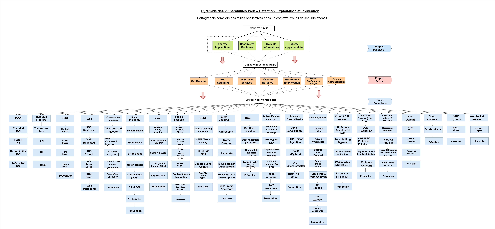

# 🧩 Pyramide des Vulnérabilités Web  
### _Détection • Exploitation • Prévention_

> **Cartographie complète des failles applicatives dans un contexte d’audit de sécurité offensif.**



---

## 🎯 Objectif du projet

Ce projet a pour but d’offrir une **vue d’ensemble structurée** des vulnérabilités Web et de leur **cycle de détection**, d’**exploitation** et de **prévention**, dans le cadre d’un **audit de sécurité offensive**.

L’idée est de présenter chaque phase sous forme **pyramidale**, depuis les étapes passives jusqu’à la détection finale, afin de comprendre :
- Comment une surface d’attaque est identifiée,
- Quelles vulnérabilités peuvent en découler,
- Et quelles sont les méthodes pour les corriger ou s’en prémunir.

---

## 🧠 Vision globale

La **pyramide principale** ci-dessus représente l’intégralité du processus :

1. **Étapes passives** → collecte d’informations, analyse du contenu, technologies et sous-domaines.  
2. **Étapes actives** → scan ciblé, enumeration, brute force, détection de failles et bypass.  
3. **Étapes de détection** → classification des vulnérabilités selon les familles OWASP (XSS, SQLi, RCE, CSRF, etc.) et bonnes pratiques de prévention.

Chaque étage de cette pyramide sera détaillé dans des sections dédiées, accompagnées de leurs propres schémas explicatifs.

---

## 🧩 Structure du dépôt

```bash
📦 Pyramide-Vulnerabilites-Web
 ┣ 📜 README.md
 ┣ 🖼️ pyramide_general.png
 ┣ 📂 docs/
 ┃ ┣ 📄 01-passif.md         # Étape passive – collecte et analyse d’informations
 ┃ ┣ 📄 02-actif.md          # Étape active – tests et interactions contrôlées
 ┃ ┗ 📄 03-detection.md      # Étape de détection – classification des vulnérabilités
 ┗ 📂 assets/
    ┗ 📂 images/             # Autres schémas et visuels complémentaires
