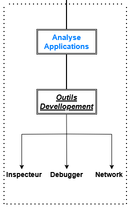

# 🧠 Analyse des Applications Web (Phase Passive)

## 🎯 Objectifs
<p align="center">
  
</p>
- Comprendre le fonctionnement technique du site web cible (ex. `website.com`)
- Collecter des informations visibles dans le navigateur **sans interagir activement avec le serveur**
- Identifier les frameworks, technologies, redirections et éléments sensibles accessibles publiquement

---

## 🔍 Points d’analyse

| Élément cible                  | Objectif                                                                 |
|-------------------------------|--------------------------------------------------------------------------|
| **Code source HTML**          | Rechercher des **commentaires**, **clés API**, **bibliothèques JS**     |
| **Fichiers JavaScript**       | Identifier les fonctions critiques, endpoints API, logique frontend      |
| **URLs et redirections**      | Identifier les paramètres, redirections internes/externes                |
| **Headers HTTP**              | Voir technos, cookies, redirections, politiques de sécurité              |
| **Frameworks détectés**       | Déterminer les versions (React, WordPress, Laravel, etc.)                |
| **Pages bloquées**            | Contourner les murs JavaScript, contenu caché accessible via l’inspecteur |
| **Comportements dynamiques**  | Observer si le site charge du contenu via JS (AJAX/fetch)               |
| **Fichiers externes**         | Scripts, styles, fontes, trackers (Analytics, etc.)                      |
| **Infos utilisateurs affichées** | Voir si des données sont exposées dans le DOM ou JavaScript            |

---

## 🛠️ Outils à utiliser

| Outil DevTools      | Fonction principale                                                  |
|---------------------|-----------------------------------------------------------------------|
| Inspecteur DOM      | Lire HTML, observer commentaires, analyser structure du document     |
| Console             | Voir erreurs JavaScript, logs, injections ou comportements suspects   |
| Sources             | Accès à tous les JS / CSS / fichiers sources du site                 |
| Network             | Requêtes, cookies, headers, endpoints AJAX, XHR, fetch, etc.         |
| Storage             | Analyse LocalStorage, SessionStorage, IndexedDB                      |
| Application         | Voir le manifeste, workers, cache, données persistées                |
| Security            | Infos HTTPS, TLS, cookies sécurisés, mixed content                   |

---

## 🧪 Techniques supplémentaires à explorer

- **Analyse de fichiers .map** : tenter d'accéder à `main.js.map` pour reconstruire du code JS non minifié
- **Observation des cookies** : présence de JWT, sessions ou infos sensibles
- **Suivi des requêtes AJAX** : repérage d’endpoints internes `/api`, `/v1/`, etc.
- **Reconstruction d’arborescence** : `/admin/`, `/login`, `/dashboard` visibles dans les scripts ou redirections
- **Détection de framework** : analyse manuelle (présence de `wp-content`, `_next`, `csrf_token`, etc.)
- **Analyse des headers de sécurité** : CSP, X-Frame-Options, X-XSS-Protection, etc.

---

## 📎 Exemple de sources utiles

- Code source visible (clic droit > "Afficher le code source")
- Chrome DevTools ou Firefox Developer Edition
- Extension Wappalyzer (pour comparaison automatique de technos)
- Wayback Machine (si les JS ont changé dans le temps)

---

## 📌 Résumé

Cette phase permet de **cartographier l'environnement applicatif** du site sans aucune action intrusive. Elle est indispensable pour mieux cibler les prochaines étapes (enum, vulnérabilités, fuzzing).

# 🔎 Découverte de Contenus Web (Phase Passive)

## 🎯 Objectifs
<p align="center">
  
</p>
- Révéler les fichiers, pages et répertoires non listés dans le menu du site.
- Identifier les technologies, frameworks, CMS, endpoints, historiques.
- Croiser les données avec des archives, hash, fingerprinting.

---

## 🧭 Étapes de Découverte

### 🟣 Étape **Manuelle**

| Élément | Description |
|--------|-------------|
| **robots.txt** | Peut révéler des pages volontairement masquées (`/admin`, `/private`, etc.) |
| **favicon.ico** | Signature d’un framework : possibilité de calculer son **hash MD5** pour identifier le CMS |
| **Commande pour récupérer le hash :** | `curl https://example.com/favicon.ico | md5sum` |
| **Base OWASP de favicon hash :** | [OWASP favicon DB](https://wiki.owasp.org/index.php/owasp_favicon.database) |
| **sitemap.xml** | Liste souvent tous les fichiers/pages indexables |
| **Analyse entêtes HTTP** | Fournit des infos sur le serveur, versions, protections |
| **Commande pour inspecter les headers :** | `curl -I http://ip_du_site` ou `curl -v http://ip_du_site` |
| **Analyse du code source HTML** | Commentaires, mentions de frameworks (`<!-- Powered by X -->`) |

---

### 🔴 Étape **Automatisée**

| Outil / Technique | Fonction |
|-------------------|----------|
| **Google Dorks** | Dorking ciblé : `site:example.com inurl:admin` |
| **Wappalyzer** | Identification techno : CMS, JS, serveurs, etc. [https://www.wappalyzer.com](https://www.wappalyzer.com) |
| **Wayback Machine** | Historique d’anciennes pages ou structures de site |
| **GitHub** | Recherche de `.env`, `credentials`, infos leaks dans dépôts publics |
| **S3 Buckets** | Fouille de `bucket.s3.amazonaws.com` ou `example.s3.amazonaws.com` |
| **Découverte automatique de répertoires** | Bruteforce de chemins cachés via des wordlists |

#### 🔧 Outils de bruteforce et leurs commandes :

```bash
# FFUF - Fast web fuzzer
ffuf -w /usr/share/wordlists/seclists/Discovery/Web-Content/common.txt -u http://IP_SERVEUR/FUZZ

# DIRB
dirb http://IP_SERVEUR /usr/share/wordlists/seclists/Discovery/Web-Content/common.txt

# GoBuster
gobuster dir -u http://IP_SERVEUR -w /usr/share/wordlists/seclists/Discovery/Web-Content/common.txt
```

---

## 🚀 Outils complémentaires (optionnels à ajouter)

| Outil | Utilité |
|-------|--------|
| **GAU (GetAllUrls)** | Liste toutes les URLs connues pour un domaine |
| `gau example.com` | Nécessite `go install github.com/lc/gau` |
| **Hakrawler** | Crawl rapide des URLs depuis un point d’entrée |
| **Arjun** | Découverte des **paramètres GET/POST** sur une URL |

---

## 📌 Notes

- Ces techniques sont **100% passives ou semi-passives**, aucun scan direct de vulnérabilité ici.
- Résultats issus de cette phase servent à alimenter l’étape de **scanning actif/fuzzing ciblé**.

- # 🕵️ Phase OSINT - Collecte d'informations (passive)

## 🎯 Objectif
Obtenir un maximum d'informations sur une cible **sans interaction directe intrusive**.  
Utilisation exclusive de sources publiques et ouvertes (Open Source Intelligence).

---

## 🧩 Partie 1 : Collecte d'informations principales

| Type de données | Outils / Commandes / Sites |
|-----------------|----------------------------|
| **WHOIS** (infos de domaine, DNS, email) | `whois example.com`<br>Site : [https://whois.domaintools.com](https://whois.domaintools.com) |
| **SSL/TLS** (certificats, CN, SAN, dates) | `echo | openssl s_client -connect example.com:443`<br>Analyse manuelle du certificat |
| **DNS passif** (sous-domaines historiques, résolutions) | - [https://crt.sh](https://crt.sh)<br>- [https://securitytrails.com](https://securitytrails.com)<br>- [https://dnsdumpster.com](https://dnsdumpster.com)<br>- [https://shodan.io](https://shodan.io)<br>- [https://spyse.com](https://spyse.com) |
| **Réseaux sociaux** (employés, techno, leaks) | Recherche sur : `LinkedIn`, `Twitter`, Google Dorks : `site:linkedin.com company +tech` |
| **Fuites de données** (emails/passwords compromis) | [https://haveibeenpwned.com](https://haveibeenpwned.com)<br>[https://dehashed.com](https://dehashed.com)<br>[https://intelx.io](https://intelx.io) |
| **Technologies exposées** | [https://builtwith.com](https://builtwith.com)<br>[https://netcraft.com](https://netcraft.com) |
| **Dépôts GitHub** (leaks de code .env, etc.) | `site:github.com "example.com"` ou outils comme `github-subdomains` |

---

## 🧩 Partie 2 : Collecte d'informations supplémentaires

| Type | Outils / Sites |
|------|----------------|
| **Trackers Google Analytics / AdSense** | - [https://spyonweb.com](https://spyonweb.com)<br>- [https://publicwww.com](https://publicwww.com) |
| **Emails liés** au domaine | - [https://hunter.io](https://hunter.io)<br>- [https://emailrep.io](https://emailrep.io) |
| **Fichiers spéciaux** (politiques, sécurité) | `http://example.com/security.txt`<br>`http://example.com/humans.txt` |
| **Favicon Hash** | `curl https://example.com/favicon.ico | md5sum`<br>Recherche via Shodan : `http.favicon.hash:<hash>` |
| **Empreintes TLS** | [https://censys.io](https://censys.io)<br>[https://crt.sh](https://crt.sh) |
| **Recherche ASN / hébergeur** | [https://bgpview.io](https://bgpview.io)<br>[https://securitytrails.com](https://securitytrails.com) |
| **Recherche par image inversée** | [https://images.google.com](https://images.google.com) (Reverse Image Search) |

---

## 💡 Astuces

- Combine les données des outils comme `crt.sh` avec `ffuf`, `subfinder`, etc. pour élargir les sous-domaines.
- Les emails récupérés peuvent être testés sur HaveIBeenPwned ou EmailRep pour voir leur réputation et compromission.
- PublicWWW et SpyOnWeb sont très utiles pour corréler plusieurs sites qui partagent **le même ID Analytics ou AdSense**.

---

## 📌 Note éthique
Toutes ces méthodes relèvent de **l’OSINT passif**.  
Elles ne génèrent **aucune alerte** ni **trafic malveillant** sur les systèmes cibles.  
Elles sont utilisées pour l’analyse, la documentation ou les tests d’intrusion **avec autorisation**.
